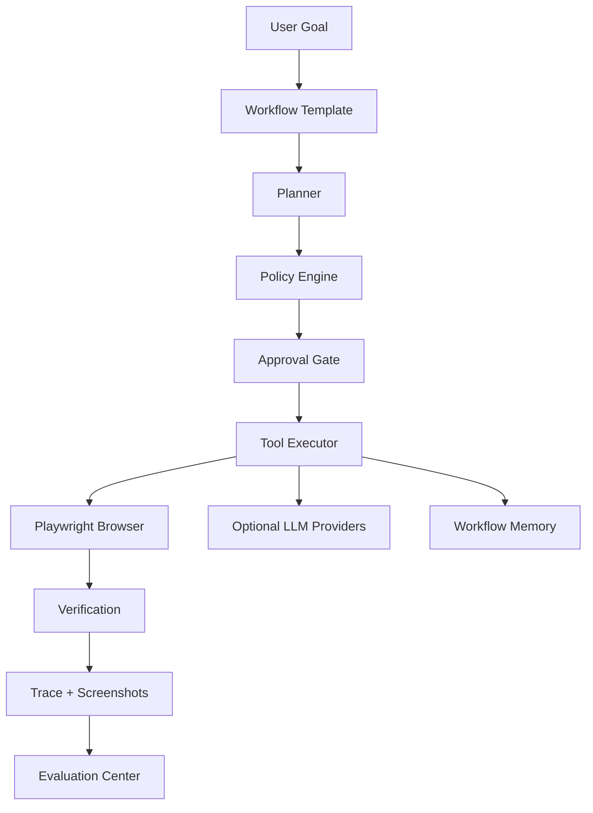

# Architecture

AI Web Form Agent is a review-first workflow automation app. It analyzes web forms, maps reusable profile data to fields, fills the page in a real browser, and stops before final submission so the user stays in control.

## Product Positioning

The project is a portfolio-grade example of safe browser automation, not a production form-submission service. The default demo runs locally without LLM API keys. Optional LLM providers can improve semantic field mapping, but deterministic rules remain the baseline path.

## System Diagram

## Backend Modules

- `app/main.py` wires the FastAPI app, routers, CORS, database startup, and screenshot serving.
- `app/database.py` owns SQLite setup and lightweight schema migrations.
- `app/routers/*` expose profiles, tasks, workflows, approvals, jobs, traces, LLM usage, benchmarks, and admin trace endpoints.
- `app/services/form_extractor.py` reads form fields from real pages through Playwright.
- `app/services/field_mapper.py` maps extracted fields to profile values with deterministic logic and optional provider help.
- `app/services/policy_answer_retrieval.py` suggests security questionnaire answers from local policy fixtures with source evidence.
- `app/services/browser_executor.py` fills the browser and captures execution evidence.
- `app/services/policy_engine.py` and `approval_gate_service.py` classify blocked and review-required actions.
- `app/services/workflow_trace_service.py` records workflow spans, screenshots, and diagnostic metadata.
- `app/services/benchmark_runner.py` and related benchmark services run local fixture evaluations.

## Frontend Pages

- Runs dashboard: recent workflow runs, backend health, and quick links.
- Workflow templates: available workflow types and approval policy summaries.
- Profiles: reusable applicant data used during form filling.
- Create run: starts a form-fill workflow from a URL and profile.
- Task detail: run status, actions, screenshots, verification, and approval controls.
- Review mapping: user inspection and correction before browser execution.
- Approvals: pending review gates.
- Evaluation: benchmark execution and comparison history.

## Workflow Loop

1. The user creates or selects a profile.
2. The user starts an enabled workflow template with a target form URL.
3. The backend extracts fields from the target page.
4. Mapping proposes profile values for fillable fields.
5. Security questionnaire mappings may add source-backed policy suggestions.
6. The user reviews and confirms mappings.
7. Playwright fills the browser.
8. Verification records field-level evidence and screenshots.
9. Final submit waits for explicit approval.

## Policy And Approval Model

The enabled form-fill template always requires approval before final submit. Passwords, OTPs, payment data, and destructive actions are blocked rather than automated. Low-confidence mappings and other risky steps are routed through review gates.

## Trace Model

Workflow traces capture phases, statuses, inputs, outputs, provider metadata, latency, cost estimates, screenshots, and error details. Traces are used for debugging and reviewer evidence, not for bypassing user review.

## Evaluation Model

Benchmarks use local HTML fixtures and expected JSON answers. They measure extraction quality, mapping accuracy, required-field coverage, action-field rejection, login-gate handling, and regression deltas between runs.
