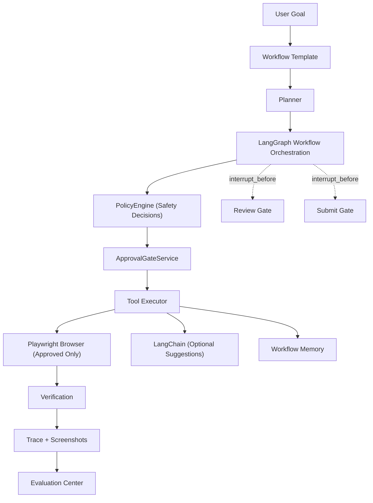

# Architecture

AI Web Form Agent is a review-first AI browser workflow assistant. It reads web pages, extracts fields or questionnaire items, retrieves profile data and source evidence, suggests answers, requires human review, fills approved values in a real browser, verifies the result, and stops before final submission so the user stays in control.

## Product Positioning

The project is a portfolio-grade example of safe browser automation, not a production form-submission service. The default demo runs locally without LLM API keys. Optional LLM providers can improve semantic field mapping, but deterministic rules remain the baseline path.

## System Diagram

## Backend Modules

- `app/main.py` wires the FastAPI app, routers, CORS, database startup, and screenshot serving.
- `app/database.py` owns SQLite setup and lightweight schema migrations.
- `app/routers/*` expose profiles, tasks, workflows, approvals, jobs, traces, LLM usage, benchmarks, and admin trace endpoints.
- `app/routers/workflows.py` exposes the workflow runtime API: start, get state, and review (internal resume).
- `app/services/form_extractor.py` reads form fields from real pages through Playwright.
- `app/services/field_mapper.py` maps extracted fields to profile values with deterministic logic and optional provider help.
- `app/services/policy_answer_retrieval.py` suggests security questionnaire answers from local policy fixtures with source evidence.
- `app/services/browser_executor.py` fills the browser and captures execution evidence.
- `app/services/policy_engine.py` and `approval_gate_service.py` classify blocked and review-required actions.
- `app/services/workflow_trace_service.py` records workflow spans, screenshots, and diagnostic metadata.
- `app/services/agent_runtime/` contains LangGraph workflow definitions for the Security Questionnaire workflow.
- `app/services/benchmark_runner.py` and related benchmark services run local fixture evaluations across rules/memory/LLM/runtime modes.

## Frontend Pages

- Runs dashboard: recent workflow runs, backend health, and quick links.
- Workflow templates: available workflow types and approval policy summaries.
- Profiles: reusable applicant data used during workflow execution.
- Create run: starts a workflow from a URL and profile.
- Task detail: run status, actions, screenshots, verification, approval controls, and agent workflow state.
- Review mapping: user inspection and correction before browser execution, including source evidence and safety flags for questionnaire workflows.
- Approvals: pending review gates.
- Evaluation: benchmark execution and comparison history with rules/memory/LLM/runtime mode comparison.

## Workflow Loop (Security Questionnaire)

The Security Questionnaire workflow uses LangGraph orchestration with interrupt points:

1. **Start**: The user clicks "Start agent workflow" in Task Detail.
2. **Analyze**: Extract questionnaire items and form fields from the page.
3. **Retrieve**: Fetch source evidence from reviewed memory or local policy documents.
4. **Suggest**: Generate answer suggestions with confidence scores and safety classifications.
5. **Policy Check**: PolicyEngine evaluates each suggestion (block/warn/safe).
6. **Review Interrupt**: LangGraph pauses with `interrupt_before=REVIEW_GATE_NODE`.
7. **Human Review**: User approves, edits, or rejects each suggestion in Review Mapping.
8. **Resume**: User clicks "Submit review", workflow resumes.
9. **Fill**: Playwright fills only approved values in the browser.
10. **Verify**: DOM verification records field-level evidence.
11. **Submit Interrupt**: LangGraph pauses with `interrupt_before=SUBMIT_GATE_NODE`.
12. **Final Approval**: User must explicitly approve before submission.

## Policy And Approval Model

The enabled form-fill template always requires approval before final submit. Passwords, OTPs, payment data, and destructive actions are blocked rather than automated. Low-confidence mappings and other risky steps are routed through review gates.

## Trace Model

Workflow traces capture phases, statuses, inputs, outputs, provider metadata, latency, cost estimates, screenshots, and error details. Traces are used for debugging and reviewer evidence, not for bypassing user review.

## Evaluation Model

Benchmarks use local HTML fixtures and expected JSON answers. They measure:

- **Core Quality**: extraction recall/precision, mapping accuracy, required-field coverage.
- **Safety**: `safety_pass_rate`, sensitive-field skip rate, unsupported-answer refusal rate.
- **Verification**: `verification_pass_rate`, fill success rate, workflow success rate.
- **Evidence**: `source_evidence_coverage`, answer accuracy.
- **Performance**: average/p95 case duration, failure rate.

Benchmark modes include:
- `rules`: Deterministic rule-based mapping and suggestions.
- `llm`: Optional LLM-enhanced mapping.
- `rag_llm`: LLM with memory retrieval.
- `langchain_rag_optional`: Falls back to rules when LLM provider is unavailable.
- `runtime`: Evaluates the full LangGraph workflow with review gates.
- `full_workflow`: End-to-end browser fill and verification.

## Architectural Boundaries

### LangGraph
- **Role**: Workflow orchestration with durable state.
- **Boundary**: Does NOT make security decisions; only enforces interrupt points.
- **Pattern**: `interrupt_before=[REVIEW_GATE_NODE, SUBMIT_GATE_NODE]` ensures human review.

### LangChain
- **Role**: Optional suggestion enhancement via LLMs and retrieval.
- **Boundary**: Does NOT execute browser actions; only provides suggestions.
- **Pattern**: Falls back to rules mode when providers are unavailable.

### PolicyEngine
- **Role**: Authoritative safety decision maker.
- **Boundary**: Owns all security classifications (block/warn/safe).
- **Pattern**: Independent of orchestration layer.

### ApprovalGateService
- **Role**: Human-in-the-loop approval enforcement.
- **Boundary**: Prevents any execution without explicit approval.
- **Pattern**: Persisted approval history for audit trails.

### Playwright
- **Role**: Approved browser execution and verification.
- **Boundary**: Only fills user-approved values; never auto-submits.
- **Pattern**: Captures DOM verification evidence for review.
