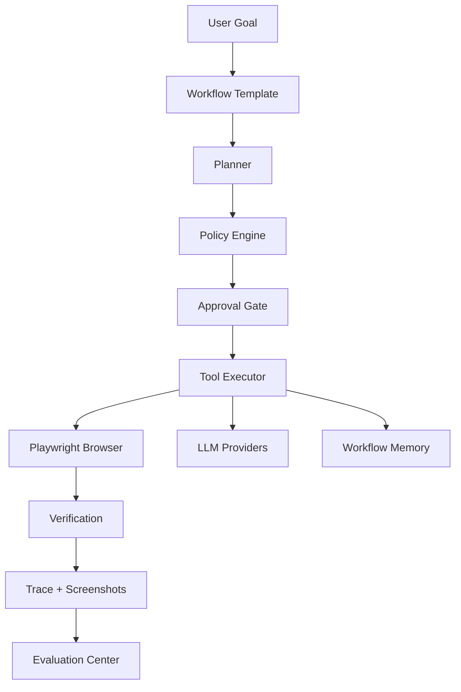

# Phase 09 - Deployment, CI, And Demo Package

## Goal

Package the upgraded project so it looks professional to reviewers and can be run, tested, and demonstrated with minimal setup.

## Why This Matters

Even strong code can look unfinished if it lacks:

- one-command startup
- CI evidence
- demo data
- architecture documentation
- evaluation report sample
- clear safety statement

This phase turns the project into a portfolio-ready artifact.

## Current Code To Read

- `README.md`
- `.gitignore`
- `backend/requirements.txt`
- `frontend/package.json`
- `docs/go-metrics-sidecar.md`
- `sidecars/metrics-go/main.go`
- `backend/benchmarks/README.md`
- existing `docs/trae-upgrade/*.md`

## Scope

Add:

- Docker files
- docker-compose
- CI workflow
- seed demo data script
- architecture documentation
- demo script
- sample evaluation report
- README rewrite

## Out Of Scope

- Do not deploy to a cloud provider.
- Do not add production auth.
- Do not add paid managed services.
- Do not require LLM API keys for the default demo.

## Docker Package

Create:

```text
Dockerfile.backend
Dockerfile.frontend
docker-compose.yml
```

### Backend Dockerfile

Requirements:

- Python 3.12 slim
- install backend requirements
- install Playwright Chromium dependencies
- expose 8000
- command:

```text
uvicorn app.main:app --host 0.0.0.0 --port 8000
```

Workdir:

```text
/app/backend
```

### Frontend Dockerfile

Simplest acceptable version:

- Node 22
- install dependencies
- build Vite app
- serve with `npm run preview -- --host 0.0.0.0`

If using Nginx adds complexity, skip it.

### docker-compose.yml

Services:

```yaml
backend:
  build:
    context: .
    dockerfile: Dockerfile.backend
  ports:
    - "8000:8000"
  environment:
    - LLM_PROVIDER=
  volumes:
    - ./backend/screenshots:/app/backend/screenshots

frontend:
  build:
    context: .
    dockerfile: Dockerfile.frontend
  ports:
    - "5173:5173"
  environment:
    - VITE_API_BASE_URL=http://localhost:8000
  depends_on:
    - backend

metrics-sidecar:
  build:
    context: ./sidecars/metrics-go
  ports:
    - "9100:9100"
  profiles:
    - metrics
```

If Go sidecar Dockerfile is needed, create `sidecars/metrics-go/Dockerfile`.

## Environment Files

Create root `.env.example`:

```text
LLM_PROVIDER=
OPENAI_API_KEY=
OPENAI_MODEL=gpt-4.1-mini
GEMINI_API_KEY=
GEMINI_MODEL=gemini-2.5-flash
DEEPSEEK_API_KEY=
DEEPSEEK_MODEL=deepseek-v4-flash
METRICS_SIDECAR_URL=
ADMIN_API_TOKEN=
```

Keep `frontend/.env.example`.

## CI

Create:

```text
.github/workflows/ci.yml
```

Jobs:

### backend

Steps:

```text
checkout
setup-python 3.12
pip install -r backend/requirements.txt
python -m playwright install chromium
cd backend
python -m pytest
```

### frontend

Steps:

```text
checkout
setup-node 22
cd frontend
npm ci
npm test
npm run build
```

### go-sidecar

Steps:

```text
checkout
setup-go 1.22
cd sidecars/metrics-go
go test ./...
```

Do not run paid LLM tests in CI.

## Demo Data

Create:

```text
backend/scripts/seed_demo_data.py
```

Purpose:

- initialize DB
- create one demo profile
- create one task pointing to local example HTML
- optionally create one benchmark run if cheap

Demo profile fields:

```text
profile_name: Demo Student
full_name: Alex Chen
email: alex.chen@example.com
phone: +1 555 0100
university: Example University
major: Computer Science
linkedin: https://linkedin.com/in/alexchen
github: https://github.com/alexchen
self_intro: Computer science student interested in AI workflow automation.
```

Run command:

```powershell
cd backend
python scripts/seed_demo_data.py
```

Do not overwrite existing user data unless `--reset` is passed.

## Documentation Files

Create:

```text
docs/architecture.md
docs/demo-script.md
docs/evaluation-report-sample.md
docs/safety-model.md
```

### docs/architecture.md

Include:

- product positioning
- architecture diagram
- backend modules
- frontend pages
- workflow loop
- policy/approval model
- trace model
- evaluation model

Mermaid diagram:



### docs/demo-script.md

3-5 minute demo:

1. Start backend/frontend.
2. Show workflow templates.
3. Create a run from local example form.
4. Generate mapping.
5. Review low-confidence field.
6. Confirm mapping.
7. Fill form.
8. Show screenshot and verification.
9. Approve final submit.
10. Show trace and evaluation report.

### docs/evaluation-report-sample.md

Include one example eval table. It may use sample numbers, but clearly label:

```text
Sample report generated from local fixtures.
```

Do not fabricate claims about production usage.

### docs/safety-model.md

Include:

- blocked actions
- review-required actions
- data not stored
- CAPTCHA/anti-bot boundary
- final submission approval
- memory safety

## README Rewrite

Update README with:

```text
# Review-first AI Workflow Automation

## What It Is
## Why It Matters
## Core Workflow
## Supported Templates
## Architecture
## Safety Model
## Evaluation
## Local Setup
## Optional LLM Providers
## Optional Metrics Sidecar
## Demo Walkthrough
## Test Commands
## Portfolio Notes
```

Keep commands accurate for Windows PowerShell.

## Test Commands

Before finishing:

```powershell
cd backend
python -m pytest
```

```powershell
cd frontend
npm test
npm run build
```

```powershell
cd sidecars/metrics-go
go test ./...
```

If Docker is available:

```powershell
docker compose build
```

## Acceptance Criteria

- Docker compose files exist.
- CI workflow exists.
- Demo seed script exists and does not overwrite existing data by default.
- Architecture, demo, evaluation sample, and safety docs exist.
- README reflects the upgraded positioning.
- Local tests pass.
- Default demo does not require LLM API keys.

## Implementation Order

1. Add Docker files.
2. Add `.env.example`.
3. Add CI workflow.
4. Add demo seed script.
5. Add architecture doc.
6. Add demo script.
7. Add sample evaluation report.
8. Add safety model doc.
9. Rewrite README.
10. Run tests/build.

## Trae Prompt

Implement Phase 09. Package the project for portfolio presentation with Docker, GitHub Actions CI, demo seed data, architecture/safety/demo/evaluation docs, and a README rewrite. The default demo must run without LLM API keys and must preserve existing local data unless an explicit reset flag is used.
